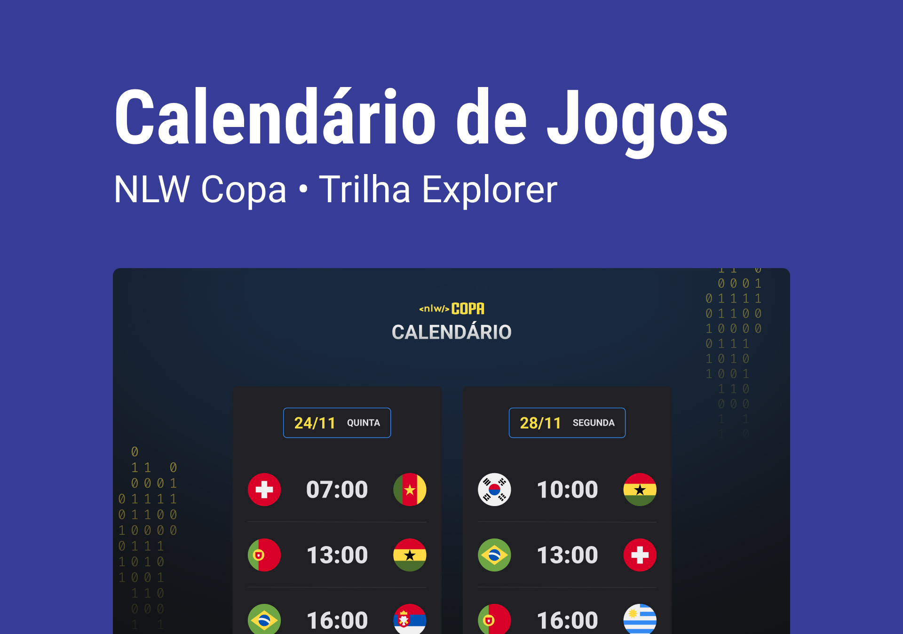

<h1 align="center"> NLW #10 - COPA </h1>

  <a href="#-tecnologias">Tecnologias</a>&nbsp;&nbsp;&nbsp;|&nbsp;&nbsp;&nbsp;
  <a href="#-projeto">Projeto</a>&nbsp;&nbsp;&nbsp;|&nbsp;&nbsp;&nbsp;
  <a href="#-layout">Layout</a>&nbsp;&nbsp;&nbsp;|&nbsp;&nbsp;&nbsp;
  <a href="#memo-licença">Licença</a>

  

 

  

## 🚀 Tecnologias

Esse projeto foi desenvolvido com as seguintes tecnologias:

- HTML e CSS
- JavaScript
- Git e GitHub

## 💻 Projeto

O projeto demonstra o calendário de jogos da Copa do Mundo de 2022.

## 🔖 Layout

Você pode visualizar o layout do projeto através [DESSE LINK](<https://www.figma.com/file/bo6jHsLpzsemVwjMrCv3BX/Calend%C3%A1rio-de-Jogos-(Community)?node-id=0%3A1/duplicate>). É necessário ter uma conta no [Figma] (https://www.figma.com) para acessá-lo.

## ⚡ Contato

contato.jpsft@gmail.com

## :memo: Licença

Esse projeto está sob a licença MIT.

---

Feito com ♥ by Rocketseat :wave:
